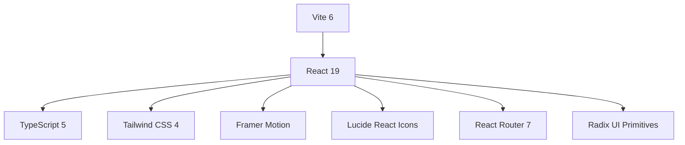
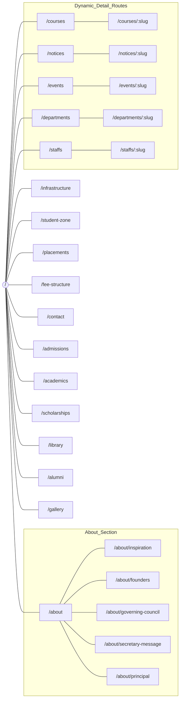
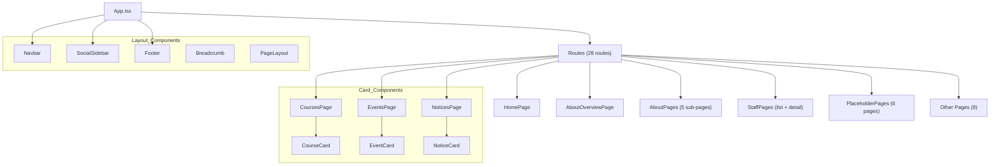
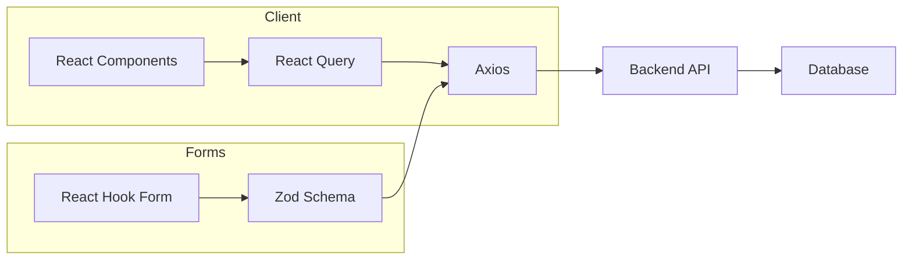

# NG Acharya Codebase Graph 📊

This document provides a visual and structural representation of the **NG Acharya & DK Marathe College** repository.

## 🏗️ Technical Stack



---

## 📂 File System Structure

```text
d:\NG Acharya\
├── dist/                    # Production build output
├── src/
│   ├── components/
│   │   ├── cards/
│   │   │   ├── CourseCard.tsx
│   │   │   ├── EventCard.tsx
│   │   │   └── NoticeCard.tsx
│   │   └── layout/
│   │       ├── Breadcrumb.tsx
│   │       ├── Footer.tsx
│   │       ├── Navbar.tsx
│   │       ├── PageLayout.tsx
│   │       └── SocialSidebar.tsx
│   ├── lib/
│   ├── pages/
│   │   ├── HomePage.tsx          (27.8 KB — largest page)
│   │   ├── AboutOverviewPage.tsx
│   │   ├── AboutPages.tsx        (Principal, Secretary, Founders, Council, Inspiration)
│   │   ├── ContactPage.tsx
│   │   ├── CourseDetailPage.tsx
│   │   ├── CoursesPage.tsx
│   │   ├── DepartmentDetailPage.tsx
│   │   ├── DepartmentsPage.tsx
│   │   ├── EventDetailPage.tsx
│   │   ├── EventsPage.tsx
│   │   ├── FeeStructurePage.tsx
│   │   ├── InfrastructurePage.tsx
│   │   ├── NoticeDetailPage.tsx
│   │   ├── NoticesPage.tsx
│   │   ├── PlaceholderPages.tsx  (Admissions, Academics, Scholarships, Library, Alumni, Gallery)
│   │   ├── PlacementsPage.tsx
│   │   ├── StaffPages.tsx
│   │   └── StudentZonePage.tsx
│   ├── types/
│   ├── utils/
│   ├── App.tsx              # Root component & routing
│   ├── main.tsx             # Entry point
│   └── index.css            # Global styles
├── index.html
├── package.json
├── vite.config.ts
└── tsconfig.json
```

---

## 🗺️ Routing Map

All 28 routes defined in `App.tsx`:



---

## 🧩 Component Hierarchy



---

## 📊 Page Size Distribution

| Page | Size | Notes |
|------|------|-------|
| `HomePage.tsx` | 27.8 KB | Hero, stats, feature sections — largest file |
| `PlaceholderPages.tsx` | 16.0 KB | 6 placeholder pages bundled |
| `AboutPages.tsx` | 14.1 KB | 5 about sub-pages |
| `StaffPages.tsx` | 13.6 KB | Staff list + detail views |
| `FeeStructurePage.tsx` | 12.5 KB | Fee tables & filters |
| `StudentZonePage.tsx` | 12.4 KB | Student resources hub |
| `PlacementsPage.tsx` | 10.8 KB | Placement stats & companies |
| `CourseDetailPage.tsx` | 10.5 KB | Individual course view |
| `EventDetailPage.tsx` | 10.4 KB | Individual event view |
| `ContactPage.tsx` | 9.8 KB | Contact form & map |
| `NoticeDetailPage.tsx` | 8.2 KB | Individual notice view |
| `CoursesPage.tsx` | 7.7 KB | Courses listing |
| `AboutOverviewPage.tsx` | 5.8 KB | About landing page |
| `EventsPage.tsx` | 4.9 KB | Events listing |
| `NoticesPage.tsx` | 4.5 KB | Notices listing |
| `DepartmentsPage.tsx` | 4.4 KB | Departments listing |
| `DepartmentDetailPage.tsx` | 3.9 KB | Department detail |
| `InfrastructurePage.tsx` | 2.4 KB | Infrastructure overview |

---

## 🛠️ Key Dependencies

| Category | Libraries |
|----------|-----------|
| **Core** | React 19, Vite 6, TypeScript 5.7 |
| **Styling** | Tailwind CSS 4, `clsx`, `tailwind-merge`, `class-variance-authority` |
| **Animation** | Framer Motion 11 |
| **UI Primitives** | Radix UI (13 components: Accordion, Dialog, Tabs, Tooltip, etc.) |
| **Icons** | Lucide React |
| **Forms** | React Hook Form + Zod validation |
| **Data Fetching** | TanStack React Query + Axios |
| **Data Viz** | Recharts |
| **Carousel** | Embla Carousel |
| **Toasts** | Sonner |
| **Routing** | React Router DOM 7 |
| **SEO** | React Helmet Async |

---

## 🔗 Data Flow


